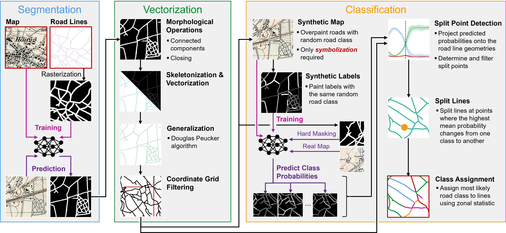

# Probabilistic road classification in historical maps using synthetic data and deep learning
Dominik J. Mühlematter, Sebastian Schweizer, Chenjing Jiao, Xue Xia, Magnus Heitzler, Lorenz Hurni - 2024
  
[[Paper on ArXiv]](https://arxiv.org/abs/2410.02250)

## Abstract
Historical maps are invaluable for analyzing long-term changes in transportation and spatial development, offering a rich source of data for evolutionary studies. However, digitizing and classifying road networks from these maps is often prohibitively expensive and time-consuming, limiting their widespread use. Recent advancements in deep learning have made automatic road extraction from historical maps feasible, yet these methods typically require large amounts of expensive labeled training data. To address this challenge, we introduce a novel framework that integrates deep learning with geoinformation, computer-based painting, and image processing methodologies. This framework enables the extraction and classification of roads from historical maps using only road geometries without needing road class labels for training. The process begins with cascaded training of a binary segmentation model to extract road geometries, followed by morphological operations, skeletonization, vectorization, and filtering algorithms. Synthetic training data is then generated by a painting function that artificially re-paints road segments using predefined symbology for road classes. Using this synthetic data, a deep ensemble is trained to generate pixel-wise probabilities for road classes to mitigate distribution shift. These predictions are then discretized along the extracted road geometries. Subsequently, further processing is employed to classify entire roads, enabling the identification of potential changes in road classes and resulting in a labeled road class dataset. Our method achieved completeness and correctness scores of over 94% and 92%, respectively, for road class 2, the most prevalent class in the two Siegfried Map sheets from Switzerland used for testing. This research offers a powerful tool for urban planning and transportation decision-making by efficiently extracting and classifying roads from historical maps, and potentially even satellite images.

<p align="center">
    <figure>
        
        <figcaption>Geodata © Swisstopo (https://www.swisstopo.admin.ch/en)
  </figcaption>
    </figure>
</p>

## Citation  
If you find our work useful or interesting, or if you use our code, please cite our paper as follows:  
  
```latex  
@misc{ProbRoadClass2024,  
  title   = {Probabilistic road classification in historical maps using synthetic data and deep learning},  
  author  = {Dominik J. Mühlematter, Sebastian Schweizer, Chenjing Jiao, Xue Xia, Magnus Heitzler, Lorenz Hurni},  
  year    = {2024},  
  note    = {arXiv:2410.02250}  
}  
```
## Model Weights
The trained model weights for this research are available on [HuggingFace](https://huggingface.co/DominikM198/ProbRoadClass-DeepLearning).

## Getting Started
Step 1: Clone or download this repository and set it as the working directory, create a virtual environment and install the dependencies.

```bash
cd ProbRoadClass-DeepLearning/ 
```

Step 2: Create a virtual environment and install the dependencies specified in the .yml files (can be found in the folder of each task).

 
## 1. 01_CNN
This section of the code is intended to train a binary road segmentation model. Once the model is trained, it generates and saves predictions for the validation and test sets to the disk.
#### Data pre-processing
For the data there should be a folder with the name "datasets" having the following structure:
```
+---segmentation
|   +---test
|   |   +---labels              -> [empty] the rasterized road geometries will be saved here automatically              
|   |   +---road_geoms          -> ESRI Shapefiles containing the linestring geometries of the road center lines
|   |   \---siegfried_sheets    -> GeoTIFF files of the scanned Siegfried Map sheets
|   +---train
|   |   +---labels              -> [empty] the rasterized road geometries will be saved here automatically
|   |   +---masks               -> GeoTIFF files with the mask if there is not full coverage of labeled road geometries for a full Siegfried Map sheet
|   |   +---road_geoms          -> ESRI Shapefiles containing the linestring geometries of the road center lines
|   |   \---siegfried_sheets    -> GeoTIFF files of the scanned Siegfried Map sheets
|   \---validate
|       +---labels              -> [empty] the rasterized road geometries will be saved here automatically
|       +---road_geoms          -> ESRI Shapefiles containing the linestring geometries of the road center lines
|       \---siegfried_sheets    -> GeoTIFF files of the scanned Siegfried Map sheets
|
\---segmentation_pretraining
    +---train
    |   +---labels              -> [empty] the rasterized road geometries will be saved here automatically
    |   +---road_geoms          -> ESRI Shapefiles containing the linestring geometries of the road center lines
    |   \---swissmap_sheets     -> GeoTIFF files of the Swiss Map Raster 25 sheets
    \---validate
        +---labels              -> [empty] the rasterized road geometries will be saved here automatically
        +---road_geoms          -> ESRI Shapefiles containing the linestring geometries of the road center lines
        \---swissmap_sheets     -> GeoTIFF files of the Swiss Map Raster 25 sheets
```

#### Train a binary road segmentation model
1. Modify the constant variable "path" in file 01_CNN/main.py by assigning the path to the desired model settings (JSON's within model_settings subfolders)
```python
path = "c:\\Road_segmentation\\road-seg-hist-maps\\01_CNN\\model_settings\\Binary_road_segmentation\\SETTINGS_FOLDER\\SETTINGS.json"
```
2. If a pre-trained model is fine-tuned, check if model weights are available within the folder 01_CNN/storage/01_CNN/models with the same name as the field "pretrained_model_name" in the chosen settings JSON file.
3. Set field value of field "save_output" to true to save predictions within the folder 01_CNN/storage/01_CNN/results
4. Run main.py file

#### Evaluate a trained model on validation or test set
1. Modify the constant variable "path" in file 01_CNN/main.py by assigning  the path to the desired model settings (JSONS's within model_settings subfolders)
```python
path = "c:\\Road_segmentation\\road-seg-hist-maps\\01_CNN\\model_settings\\Binary_road_segmentation\\SETTINGS_FOLDER\\SETTINGS.json"
```
2. Check if model weights are available within the folder 01_CNN/storage/01_CNN/models with the same name as the field "pretrained_model_name" in the chosen settings JSON file. 
3. Set field value of field "save_output" to true to save predictions within the folder 01_CNN/storage/01_CNN/results
4. Run main.py file

#### Model settings

| Model             | Train settings  | Val settings   | Test settings     |  Test accuracy | Test IoU |
|----------------------|------------------------|-----------------------|-------------------|------------------------------------------|------------------------------|
| <sup>Small U-Net<sup> | <sup>Siegfried_settings_baseline0.json<sup> | <sup>Siegfried_settings_baseline0_val.json<sup> | <sup>Siegfried_settings_baseline0_test.json<sup> | <sup>97.76% <sup> |<sup>76.86%<sup>|
| <sup>Attention ResU-Net no pre-training<sup> | <sup>Siegfried_settings_full_training2.json<sup> | <sup>Siegfried_settings_full_training2_val.json<sup> | <sup>Siegfried_settings_full_training2_test.json<sup>| <sup>98.07%<sup> |<sup>79.30%<sup>|
| <sup>Attention ResU-Net ImageNet<sup> | <sup>Siegfried_settings_not_pretrained_finetuning1.json<sup> | <sup>Siegfried_settings_not_pretrained_finetuning1_val.json<sup> | <sup>Siegfried_settings_not_pretrained_finetuning1_test.json<sup> |<sup>98.08% <sup> |<sup>78.55%<sup>|
| <sup>Attention ResU-Net ImageNet + Swiss Map<sup> | <sup>Siegfried_settings_Res_U_Net_ImageNet_Swissmap2.json<sup> | <sup>Siegfried_settings_Res_U_Net_ImageNet_Swissmap2_val.json<sup> | <sup>Siegfried_settings_Res_U_Net_ImageNet_Swissmap2_test.json<sup> | <sup>98.37%<sup> |<sup>82.10%<sup>|


Additional experiment settings can be located in the respective subdirectories:

1. Model_selection_study:
   - Settings for training with different learning rates for the models listed in the table above for hyperparameter tuning.

2. Data_augmentation_study:
   - Settings for evaluating various data augmentation strategies with the Small-U-Net architecture.

3. Pretraining:
   - Settings for pre-training and evaluating the model on Swiss Map.

   

## 2. 02_Postprocessing_Segmentation

#### Data
The script requires following folder structure:
```
+---02_postprocessing_segmentation
    +---input        -> GeoTIFF files of the scanned Siegfried Map sheets; predicted TIFF files from the segmentation
    +---output       -> [empty]
    \---temp         -> [empty]
```

#### Setting
Set settings in the header of the file script_postprocessing_segmentation.py
- Set the sheet numbers of the Siegfried map sheets which should be processed
```python
SHEET_NUMBERS = ['017', '199', '385']
```
- Set the prefix of the Siegfried map sheet files e.g. 'rgb_TA_' if the file is named 'rgb_TA_017.tif'
```python
SIGFRIED_FILENAME_PREFIX = 'rgb_TA_'
SIGFRIED_FILENAME_SUFFIX = ''
```
- Set the area threshold for the connected components filtering
```python
CC_AREA_THRESHOLD = 100
```
- Set the threshold for the Douglas-Peucker algorithm
```python
DOUGLAS_PEUCKER_THRESHOLD = 1.9
```

#### Run script
- Run file script_postprocessing_segmentation.py
- The output will be saved in the folder "02_postprocessing_segmentation/output" and will have an ESRI Shapefile per processed Siegfried sheet containing the road geometries. These files will be named like {sheet_number}_road_geoms.shp.

## 3. 01_CNN

#### Data
For the data, there should be a folder with the name "datasets" having the following structure:
```
+---classification
    +---test
    |   +---road_geoms_ground_truth    -> [optional] ESRI Shapefiles containing the labeled linestring geometries of the road center lines (with road class labels)
    |                                     This data can be used for the evaluation and/or to overpaint the map with the actual road classes for visual inspection.
    |   +---road_geoms_predicted       -> ESRI Shapefiles containing the predicted linestring geometries of the road center lines
    |   +---siegfried_sheets           -> GeoTIFF files of the scanned Siegfried Map sheets
    |   +---temp                       -> [empty]
    |   \---tiles                      -> [empty]
    +---train
    |   +---masks                      -> GeoTIFF files with the mask if there is not full coverage of labeled road geometries for a full Siegfried Map sheet
    |   +---road_geoms_ground_truth    -> ESRI Shapefiles containing the labeled linestring geometries of the road center lines (without road class labels)
    |   +---road_geoms_syn_labeled     -> [empty]
    |   +---siegfried_sheets           -> GeoTIFF files of the scanned Siegfried Map sheets
    |   +---temp                       -> [empty]
    |   \---tiles                      -> [empty]
    \---validate
        +---road_geoms_ground_truth    -> ESRI Shapefiles containing the labeled linestring geometries of the road center lines (without road class labels)
        +---road_geoms_syn_labeled     -> [empty]
        +---siegfried_sheets           -> GeoTIFF files of the scanned Siegfried Map sheets
        +---temp                       -> [empty]
        \---tiles                      -> [empty]
```

#### Data pre-processing for classification (create synthetic data)
*Settings*

Set the constants in the header of the file create_synthetic_data.py
- Set the buffer size in pixels to draw the labels of the road classes
```python
BUFFERSIZE_LABELS = 10
```
- Set the buffer size in pixels to overpaint the Siegfried map sheets with the predicted road geometries.
```python
BUFFERSIZE_BACKGROUND_OVERPAINTING = 17
```
- Set the buffer size in pixels of the break point labels
```python
BREAKPOINT_BUFFER_RADIUS = 8
```

*Symbolization*

Define the hyperparameter of the symbolization (deterministic and stochastic) in the header of the file script_preprocess_classfication_data.py
```python
PAINTING_STD = {
    'offset': 0.2,  # meter
    'dash': 0.5,  # meter
    'thickness': 0.35  # pixel
}

SYMBOLIZATION = {
    5: {
        'offset': 8.25,  # meter
        'thickness_line_1': 3,  # pixel
        'thickness_line_2': 1.5  # pixel
    },
    4: {
        'offset': 5.6,  # meter
        'thickness': 1.5  # pixel
    },
    3: {
        'offset': 4.7,  # meter
        'gap_length': 7.5,  # meter
        'dash_length': 11,  # meter
        'thickness_line_dashed': 1.75,  # pixel
        'thickness_line_solid': 1.75  # pixel
    },
    2: {
        'thickness': 2,  # pixel
    },
    1: {
        'gap_length': 12.5,  # meter
        'dash_length': 17.5,  # meter
        'thickness': 2,  # pixel
    }
}
```


*Run script*

This will create the synthetic data for the road classification task and save all relevant tiles in the dataset folder.

Run create_synthetic_data.py


#### Train ensemble for road classification
1. Modify the path on line 29 in file 01_CNN/train_ensemble.py by assigning  the absolute path to the desired model settings (folder with "Siegfried_settings_classification" JSON's)
```python
settings_path = const.SETTINGS_DIR.joinpath("c:\\Road_segmentation\\road-seg-hist-maps\\01_CNN\\model_settings\\Road_classification_final\\Siegfried_settings_classification_{}.json".format(i))
```
2. Specify the number of ensemble members by modifying the variable "N_members" in file 01_CNN/train_ensemble.py
```python
n_members = 30
```
3. If a pre-trained model is fine-tuned, check if model weights are available within the folder 01_CNN/storage/01_CNN/models with the same name as the field "pretrained_model_name" in the chosen settings JSON file. 
4. Run train_ensemble.py file

#### Evaluate a trained model on validation or test set
1. Modify constant variable "path" in file 01_CNN/main.py by assigning  path to the desired model settings (JSON's within model_settings subfolders)
```python
path = "c:\\Road_segmentation\\road-seg-hist-maps\\01_CNN\\model_settings\\Road_classification_final\\Siegfried_settings_classification_30_members_val.json"
```
2. Check if model weights for each ensemble member are available within the folder 01_CNN/storage/01_CNN/models with the same name as the field "pretrained_model_name" in the chosen settings JSON file. 
3. Set field value of field "save_output" to true to save predictions within the folder 01_CNN/storage/01_CNN/results in the ensemble model settings.
4. Run main.py file

#### Model settings
The settings for training the ensemble members and evaluating the ensembles can be found in the folder 01_CNN//model_settings//Road_classification_final. The final model used for the paper contained 30 members.

## 4. 03_Postprocessing_Classification
#### Data
The script requires the following folder structure:
```
+---02_postprocessing_classification
    +---input        -> GeoTIFF files of the scanned Siegfried Map sheets; predicted road geometries from the segmentation; predicted TIFF files from the classification
    +---output       -> [empty]
    \---temp         -> [empty]
```

#### Setting
Set settings in the header of the file script_postprocessing_classification_breakpoint_approach.py
- Set the sheet numbers of the Siegfried map sheets which should be processed
```python
SHEET_NUMBERS = ['017', '199', '385']
```
- Set the prefix of the Siegfried map sheet files, e.g. 'rgb_TA_' if the file is named 'rgb_TA_017.tif'
```python
SIGFRIED_FILENAME_PREFIX = 'rgb_TA_'
SIGFRIED_FILENAME_SUFFIX = ''
```

- Set an prefix/identifier string that is used to store the result in a unique output folder and is contained by each output file, e.g. if the string is 'minline_80m_seg_10m', then the file is named '{sheet_number}_road_geoms_minline_80m_seg_10m.shp'
```python
OUTPUT_FILENAME_PREFIX = 'minline_80m_seg_10m'
```

- Set one or more buffer sizes in meters to calculate the zonal statistics
```python
BUFFERSIZES_METER = [6] # meters
```

- The hyperparameter for the split point detection are defined by:
```python
SPLIT_POINT_DETECTION_DISCRETIZATION = 10  # meters
SPLIT_POINT_DETECTION_CROP_DISTANCE = 20  # meters
SPLIT_POINT_DETECTION_MINIMUM_LINE_LENGTH = 80  # meters
SPLIT_POINT_DETECTION_PLOT_FLAG = False
```

#### Run script
- Run file script_postprocessing_classification.py
- The output will be saved in the folder "03_postprocess_classification/output" and will have an ESRI Shapefile per processed Siegfried sheet containing the road geometries. These files will be named like {sheet_number}_roads.shp.


## 5. 04_evaluation
#### Data pre-processing
1. Create a subfolder within the folder "04_evlaution" and add predicted line geometries as shapefiles.
2. Modify variables within file 04_evaluation//preprocess_predictions.py:
```python
tiles = ["199_1941", "385_1941"] # tiles to evaluate
name_predictions = "_road_geoms_analytical_breakpoints_minline_150m_seg_10m_6m.shp" # ending of name of shapefiles
local_path_predictions = "analytical_breakpoints_minline_150m_seg_10m_6m\\" # local path to location of the shapefiles
```
#### Evaluation
1. Run file evaluation.py
